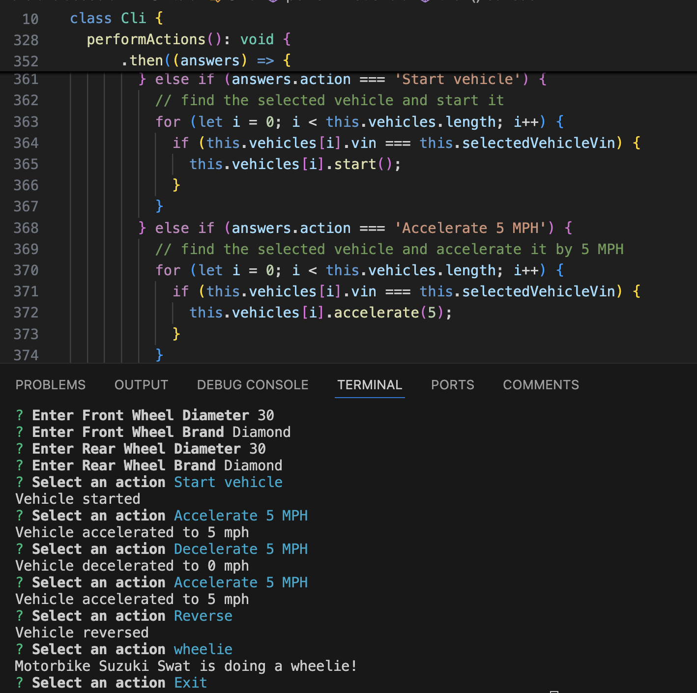

<h1 align="center">Update Vehicle Application</h1>  

### Description
This application updated an existing vehicle application that could create cars.  The updated application now can create Trucks and Motorbikes. It can create new vehicles or use existing vehicles to run the program. The user can interact with the Command Line Interface. The CLI tool asks a series of questios that automaticallly creates a car, a truck or a motorbike based on the user input. Once the vehicle is created user can choose a variety of actions. If you choose to print the newly created vehicle, it will print all the details of the vehicle you created. The vehicles come with some actions. The user can select an action from lists of choices. It accepts the action from the user and it can print the actions. The user can continue to perform actions until chooses to exit.

### Technologies
The application uses the following technologies:
- **Node.js modules** : It provides the NPM packages.
- **Inquirer** : To prompt questions and store in arrays.
- **Interfaces** : Contains particular action functions.
- **package.json**: It serves as the project’s metadata file and includes important information such as the project name, version, description, dependencies, and scripts. It is used by npm (Node Package Manager) to manage the project's modules, scripts, versioning, and more.
- **Typescript** : Typescript strictly implements the datatypes.
 
### Table of Contents
- [Installation](#installation)
- [Usage](#usage)
- [Contributing](#contributing)
- [Tests](#tests)
- [License](#license)

### Installation
You can clone the project into your working directory. Then run npm install.
 
### Usage
To run the application simply write 'npm start'. First, it will ask you if you want to make a new Vehicle or select an existing vehicle. You are required to choose an option. You can use arrows keys to make a selection. If you select create a new vehicle, it will ask you to make a selection from a list of Car, Truck and Motorbike. Once you make a selection of a vehicle, it will ask you input the details of the vehiclde like Color, Make, Model, Year, Weight and Top Speed. When you complete entering the vehicle details, it will provide you with a list of actions that you can choose from. The actions are as follows: Print Vehicle Details, Start vehicle, Accelerate 5 MPH, Decelerate 5 MPH, Stop vehicle, Turn right, Turn left, Reverse or Stop the vehicle. In addition, there are options to select or create another vehicle. If you select to create a Truck or select an existing truck, it will ask to you to input Towing Capacity. If you can exit the application by choosing exit from the list of actions.

### Contributing
If you wish to contribute, you can clone the project from the repository and creae a fork. Then create a banch and add your you contribution.

### Tests
N/A
### License
N/A

### Questions
If you have any questions, please visit my GitHub profile or email me.
-  GitHub profile:Pllutarch1971 
-  Email: matthewpmendez@gmail.com 

### Screenshots

  
### Application Video
- https://youtu.be/SX0ABP5pOu4